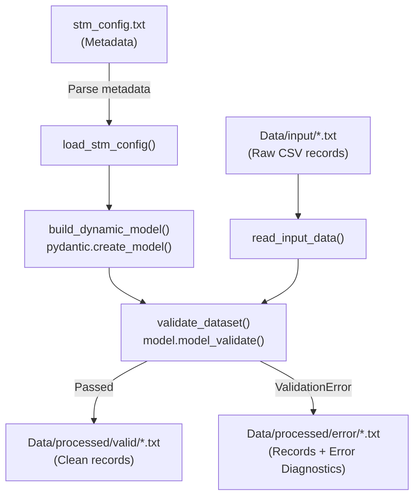

# Dynamic Data Validation with Pydantic V2

This document provides a comprehensive explanation of the dynamic data validation architecture implemented in [`dataProcessor.py`](file:///c:/Sourav/Study/FDE/Study/Python/pydantic-validation-cac/Dynamic-Validation/dataProcessor.py), detailing the motivation, core concepts, function-by-function walkthrough, and key learnings for building metadata-driven data pipelines.

---

## 1. Problem Statement & Motivation

In traditional Python and Pydantic implementations, data models are defined statically at compile time:

```python
# Static approach - Rigid and requires code changes for new sources
class Employee(BaseModel):
    empid: int
    ename: str = Field(..., max_length=500)
    sal: float
    addr: str = Field(..., max_length=2000)
    dept: int
```

### The Challenge
In real-world Data Engineering (ETL/ELT) and data ingestion pipelines:
- Schemas evolve frequently (columns are added, renamed, or types change).
- You may ingest dozens or hundreds of different files (e.g., `emp.txt`, `dept.txt`, `sales.txt`, etc.).
- Creating individual hard-coded Pydantic classes for each file violates the **DRY (Don't Repeat Yourself)** principle and requires code deployments for simple schema updates.

### The Solution: Dynamic Runtime Validation
By pairing an external **Source-to-Target Mapping (STM)** configuration file with Pydantic V2's `create_model()`, we can:
1. Define schemas externally (e.g., in a config file, database table, or metadata store).
2. Generate Pydantic models **dynamically at runtime** without modifying Python code.
3. Validate any incoming dataset irrespective of its structure, segregating clean records from malformed records.

---

## 2. Directory Structure & Data Flow

```
Dynamic-Validation/
├── Config/
│   └── stm_config.txt          # Source-to-Target mapping configuration
├── Data/
│   ├── input/
│   │   ├── emp.txt             # Raw employee data (contains 1 malformed row)
│   │   └── dept.txt            # Raw department data (contains 1 malformed row)
│   └── processed/
│       ├── valid/              # Successfully validated records
│       └── error/              # Failed records with 'validation_error' description
├── dataProcessor.py            # Main pipeline driver
```

### High-Level Architecture Flow



---

## 3. Detailed Walkthrough of Functions in `dataProcessor.py`

### 3.1. `load_stm_config(config_file: Path) -> Dict[str, Dict[str, Any]]`

- **Purpose**: Ingests and parses the metadata file [`stm_config.txt`](file:///c:/Sourav/Study/FDE/Study/Python/pydantic-validation-cac/Dynamic-Validation/Config/stm_config.txt).
- **Configuration Format**:
  ```csv
  source_file_name,taget_table_name,source_col_Name,source_col_type,source_col_length
  emp.txt,emp,empid,int,
  emp.txt,emp,ename,string,500
  emp.txt,emp,sal,float
  dept.txt,dept,deptid,int
  dept.txt,dept,dname,string,500
  ```
- **Key Implementation Details**:
  - Uses `csv.reader` rather than naive string splitting to cleanly handle quoted values, variable column counts (e.g., lines without a trailing comma for length), and whitespace.
  - Groups columns per source file:
    ```python
    {
        "emp.txt": {
            "target_table": "emp",
            "columns": [
                {"name": "empid", "type": "int", "length": None},
                {"name": "ename", "type": "string", "length": 500},
                {"name": "sal", "type": "float", "length": None},
                ...
            ]
        }
    }
    ```
  - Gracefully converts the optional `source_col_length` string into an `int`, logging a warning if an invalid integer is passed instead of crashing the job.

---

### 3.2. `build_dynamic_model(model_name: str, column_specs: List[Dict[str, Any]]) -> Type[BaseModel]`

- **Purpose**: Constructs a custom Pydantic V2 model class dynamically in memory.
- **The Core Pydantic Concept**:
  Pydantic provides `create_model(model_name, **field_definitions)`:
  ```python
  from pydantic import create_model, Field

  dynamic_model = create_model(model_name, **field_definitions)
  ```
- **Field Definition Syntax**:
  Each field in `field_definitions` is supplied as a tuple of `(field_type, field_default_or_field_info)`:
  - `(int, Field(...))` $\rightarrow$ Required integer.
  - `(str, Field(..., max_length=500))` $\rightarrow$ Required string with a maximum character length of 500.
  - `...` (Python's built-in `Ellipsis`) tells Pydantic that the field is **mandatory** with no default value.
- **Data Type Mapping**:
  The helper dictionary `DATA_TYPE_MAP` maps metadata strings (`"int"`, `"string"`, `"float"`, `"bool"`) to native Python types (`int`, `str`, `float`, `bool`).

---

### 3.3. `read_input_data(file_path: Path) -> Tuple[List[str], List[Dict[str, str]]]`

- **Purpose**: Reads raw delimited CSV data from [`Data/input/`](file:///c:/Sourav/Study/FDE/Study/Python/pydantic-validation-cac/Dynamic-Validation/Data/input).
- **Key Implementation Details**:
  - Uses `csv.DictReader` to convert each row into a dictionary where keys are column names and values are strings.
  - Strips leading and trailing whitespaces from headers and data values to prevent false negatives caused by formatting inconsistencies.
  - Returns both the header order (`List[str]`) and list of row dicts (`List[Dict[str, str]]`).

---

### 3.4. `validate_dataset(model: Type[BaseModel], records: List[Dict[str, str]]) -> Tuple[List[Dict[str, Any]], List[Dict[str, Any]]]`

- **Purpose**: Validates records row-by-row and segregates them into clean and erroneous sets.
- **The Core Validation Step**:
  ```python
  try:
      validated_instance = model.model_validate(record)
      valid_records.append(validated_instance.model_dump())
  except ValidationError as err:
      ...
  ```
- **How Pydantic Validates**:
  1. **Type Coercion**: Because CSV values enter as strings (e.g. `'100'`, `'203.5'`), Pydantic attempts to coerce them to the expected target types (`int`, `float`).
  2. **Type Enforcement**: If a value cannot be coerced (e.g., `'a'` for an `int` column), Pydantic raises a `ValidationError`.
  3. **Constraint Validation**: String fields check constraints like `max_length`.
- **Error Extraction & Enrichment**:
  When a `ValidationError` occurs, we inspect `err.errors()`:
  - `e["loc"]`: Tuple indicating the failing column name (e.g., `('empid',)`).
  - `e["msg"]`: Descriptive reason (e.g., `"Input should be a valid integer, unable to parse string as an integer"`).
  - The failing row is enriched with a new column: `validation_error`.

---

### 3.5. `write_csv_data(file_path: Path, records: List[Dict[str, Any]], headers: List[str]) -> None`

- **Purpose**: Writes processed datasets out to disk in standard CSV format.
- **Key Implementation Details**:
  - Calls `file_path.parent.mkdir(parents=True, exist_ok=True)` to guarantee the destination directory exists prior to file operations.
  - Uses `csv.DictWriter(..., extrasaction="ignore")` to prevent errors if extra unmapped fields are encountered.
  - Writes the header row followed by all rows.

---

### 3.6. `process_single_file(...)` & `run_pipeline()`

- **Purpose**: Pipeline coordinators.
- **Workflow**:
  1. Ensures output directories (`Data/processed/valid` and `Data/processed/error`) exist.
  2. Loads metadata mapping for all configured tables.
  3. Sequentially triggers:
     - Read input file.
     - Generate runtime dynamic model.
     - Validate data and classify rows.
     - Write clean records to `Data/processed/valid/<filename>`.
     - Write failed records to `Data/processed/error/<filename>`.
  4. Emits detailed structured logs indicating counts of valid vs. invalid records.

---

## 4. Key Learnings & Pydantic V2 Best Practices

### 1. Pydantic V1 vs Pydantic V2 Methods
If you are transitioning to or learning Pydantic V2:
| Operation | Pydantic V1 | Pydantic V2 |
| :--- | :--- | :--- |
| Validate dictionary | `Model.parse_obj(data)` | `Model.model_validate(data)` |
| Convert model to dict | `model.dict()` | `model.model_dump()` |
| Export JSON schema | `Model.schema()` | `Model.model_json_schema()` |
| Field definition | `Field(...)` | `Field(...)` |

### 2. Using `create_model` vs Inheritance
- Use standard class declaration (`class MyModel(BaseModel): ...`) when schemas are **static, known ahead of time, and bound to fixed business logic**.
- Use `create_model()` when schemas are **driven by external metadata, user input, dynamic configurations, or multi-tenant database tables**.

### 3. Robust Error Handling in Data Engineering
In batch processing:
- **Never crash the whole pipeline on bad records**: Catching `ValidationError` on a per-row basis allows processing valid records while capturing invalid records in a dead-letter / error table for auditing.
- **Enrich error rows with diagnostics**: Attaching the exact field location (`loc`) and error message (`msg`) allows downstream teams to fix source data quickly.

### 4. Robust Path Handling with `pathlib`
Instead of using fragile hardcoded relative paths like `open("Data/input/emp.txt")`:
```python
BASE_DIR = Path(__file__).resolve().parent
INPUT_DIR = BASE_DIR / "Data" / "input"
```
This guarantees the script runs identically whether invoked from the project root or from inside the subfolder.

---

## 5. Execution Example & Output Verification

### Running the pipeline:
```bash
uv run .\Dynamic-Validation\dataProcessor.py
```

### Console Output:
```text
[INFO] Starting Dynamic Validation Data Pipeline
[INFO] Loading STM configuration from: ...\Config\stm_config.txt
[INFO] Successfully loaded configuration for 2 source file(s): ['emp.txt', 'dept.txt']
[INFO] ============================================================
[INFO] Processing File: emp.txt
[INFO] Read 4 record(s) from emp.txt
[INFO] Constructed runtime model 'EmpDynamicModel' with fields: ['empid', 'ename', 'sal', 'addr', 'dept']
[INFO] Validation completed: 3 VALID, 1 ERROR
[INFO] Written valid records to: ...\Data\processed\valid\emp.txt
[INFO] Written error records to: ...\Data\processed\error\emp.txt
[INFO] ============================================================
[INFO] Processing File: dept.txt
[INFO] Read 4 record(s) from dept.txt
[INFO] Constructed runtime model 'DeptDynamicModel' with fields: ['deptid', 'dname']
[INFO] Validation completed: 3 VALID, 1 ERROR
[INFO] Written valid records to: ...\Data\processed\valid\dept.txt
[INFO] Written error records to: ...\Data\processed\error\dept.txt
[INFO] ============================================================
[INFO] Dynamic Validation Pipeline Completed Successfully!
```

### Resulting Files:

#### 1. Valid Employee Output (`Data/processed/valid/emp.txt`):
```csv
empid,ename,sal,addr,dept
1,sourav,100.0,blr,3
2,nayak,203.5,ctc,2
3,sakal,300.0,bbsr,1
```

#### 2. Error Employee Output (`Data/processed/error/emp.txt`):
```csv
empid,ename,sal,addr,dept,validation_error
a,skd,300,bbsr,1,"empid: Input should be a valid integer, unable to parse string as an integer"
```

#### 3. Valid Department Output (`Data/processed/valid/dept.txt`):
```csv
deptid,dname
1,sales
2,marketing
3,finance
```

#### 4. Error Department Output (`Data/processed/error/dept.txt`):
```csv
deptid,dname,validation_error
b,general,"deptid: Input should be a valid integer, unable to parse string as an integer"
```
